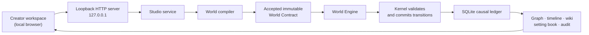

# World Studio

**A local-first World Engine for creating, evolving, and inspecting causal Worlds.**

World Studio turns a structured World definition into an immutable Contract,
evolves it through deterministic mechanisms, and keeps the resulting history
auditable. It is designed for creators who want a World to have rules,
consequences, branches, and inspectable evidence—not a prewritten plot.

> **Runtime:** one local Node.js process and one local SQLite database. No cloud
> account, Agent runtime, API key, or external service is required.

## Why World Studio

- **Rules are executable.** Resource bounds, field-write authority, causal
  reachability, and World-specific invariants are checked before state changes
  commit.
- **History is causal.** Every run records the inputs, state reads, writes,
  emissions, branches, and closure evidence behind its result.
- **Worlds stay isolated.** Each Contract, Instance, Run, projection, and
  database record is scoped by `worldId`.
- **The creator keeps authority.** A World definition is validated, compiled
  into a candidate, then explicitly accepted as an immutable Contract.
- **It runs locally.** The browser UI talks only to a loopback server; all World
  data is stored in a local SQLite file.

## Quick start

### Requirements

- Node.js 24 or newer

### Run locally

```bash
git clone git@github.com:tongyan0917/world-studio.git world-studio
cd world-studio
npm install
npm run studio
```

Open [http://127.0.0.1:4317](http://127.0.0.1:4317).

The first launch creates `.world-studio/world-studio.sqlite` and seeds two demo
Worlds: **Salt Marsh** and **玄霄九域**.

### Use another database or port

```bash
npm run studio -- --db /absolute/path/to/world-studio.sqlite --port 4317
```

Equivalent environment variables are `WORLD_STUDIO_DB` and `PORT`.

## What happens when a World runs



The engine starts from declared conditions and evaluates versioned mechanisms at
macro, meso, and micro boundaries. Mechanisms may propose typed actions, but the
Kernel is the only component that commits World state.

## Core concepts

| Concept | Meaning |
| --- | --- |
| **Blueprint** | Editable source definition: ontology, assumptions, rules, mechanisms, initial graph, and sources. |
| **Contract** | A validated, accepted, immutable version of one World’s governing model. |
| **Instance** | The initial typed state bound to a Contract. |
| **Run** | A deterministic possible history evolved from an Instance and an explicit seed. |
| **Branch** | A replayable alternative history from a verified point in a parent Run. |
| **Projection** | A read-only graph, timeline, wiki, setting book, or audit derived from committed state. |

## Included capabilities

- JSON-based World authoring with structured questions for consequential gaps.
- Typed nodes, edges, facts, resources, organizations, institutions, hazards,
  relationships, and perspective-scoped information.
- World-specific hard rules, including numeric ranges, mechanism write authority,
  and required causal relationships.
- Deterministic macro/meso/micro evolution with causal-closure checks.
- Pause, resume, branch, explain, impact, and compare workflows.
- Local Wiki, backlinks, search, graph, timeline, map, and setting-book export.
- SQLite persistence with World-scoped records and restart-safe replay.

## Project layout

```text
src/
  kernel/        Commit, validation, tracing, and replay primitives
  world-model/   Blueprint compiler, rules, mechanisms, evolution, persistence
  studio/        Loopback HTTP API and browser workspace
test/            Unit, API, history, and UI coverage
```

The two built-in example Worlds and the mechanism library live in
`src/world-model/examples.ts`.

## Experimental examples

The following directories are retained as **experimental reference material**.
They are useful for studying earlier engine and interaction ideas, but are not
part of the supported Studio workflow and may change or disappear without a
compatibility guarantee:

- `src/proof00/` — an early engine proof. Run with `npm run proof00`.
- `src/prototypes/proof01a/` and `src/prototypes/proof01a-web/` — an early
  causal-model and browser prototype. Run with `npm run prototype:proof01a`
  or `npm run prototype:proof01a:web`.
- `src/prototypes/proof01b-causal-phase/` and `src/prototypes/proof01b-web/`
  — a causal-phase prototype and its static browser material. Run the model
  with `npm run prototype:proof01b`.

For a stable local experience, use `npm run studio` and the commands in the
next section.

## Commands

| Command | Purpose |
| --- | --- |
| `npm run studio` | Start the local creator workspace. |
| `npm test` | Run the local test suite. |
| `npm run world:acceptance` | Compile and evolve the two bundled demo Worlds in memory. |
| `npm run acceptance:fresh` | Run a clean product-level acceptance flow and write its evidence to `runs/`. |
| `npm run test:browser` | Drive the local browser workflow and write browser evidence to `runs/`. |

`runs/` and local SQLite files are ignored by Git.

## Local API

The browser uses a local JSON API exposed only on `127.0.0.1`. Useful health
checks include:

```bash
curl http://127.0.0.1:4317/api/health
curl http://127.0.0.1:4317/api/worlds
```

The public API supports World authoring, compilation, run control, branches,
explanations, impact analysis, comparison, Wiki pages, and exports. The API is
local-only; it is not an authenticated multi-user service.

## Model API integration: optional, not included

This distribution intentionally has **no model provider, API client, Agent
runtime, keychain dependency, or API-key configuration**. It is fully usable
offline.

A direct model integration can be added without an Agent runtime. The recommended
shape is a server-side, OpenAI-compatible adapter with configuration such as:

```bash
export WORLD_STUDIO_MODEL_BASE_URL="https://provider.example/v1"
export WORLD_STUDIO_MODEL_API_KEY="your-api-key"
export WORLD_STUDIO_MODEL_NAME="your-model-name"
```

Those names are a proposed extension contract, **not active configuration in
this version**. A future adapter should:

1. Read credentials only in the Node server process; never expose them to the
   browser, SQLite records, logs, or exports.
2. Send only the selected World’s bounded context to the provider.
3. Require strict structured output and treat every model result as a proposal.
4. Route every proposal through the existing compiler and Kernel rules before
   acceptance or commit.
5. Fail closed or continue with deterministic behavior when the provider is
   unavailable.

This keeps the execution model simple: an Agent can be a development tool or a
future client of World Studio, but it is not part of the application runtime.

## Data and privacy

- The server binds to loopback only.
- World data stays in the configured local SQLite database.
- No network request is made by the current application.
- Generated databases, WAL files, and run evidence are ignored by Git.

## Verification

```bash
npm test
npm run world:acceptance
```

The test suite covers authoring, rules, causal paths, persistence, history,
branches, the local HTTP API, and the browser workspace. The acceptance command
checks both bundled Worlds without creating a database file.

## Current limits

- The installed time adapter is linear and discrete.
- SQLite uses Node.js’s built-in experimental SQLite API.
- This is a local, single-user application, not a hosted collaboration service.
- Theory Packs are conditional lenses, not universal laws or guarantees of
  scientific realism.

## Contributing

Keep World behavior deterministic and testable. New World rules, mechanisms,
or persistence changes should include focused tests and preserve the boundary:
the Kernel commits state; interfaces and projections do not.

## License

This project is licensed under the [MIT License](LICENSE).
